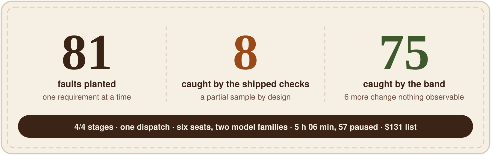
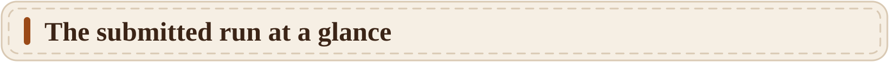
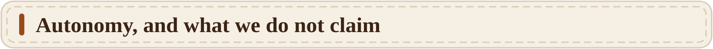
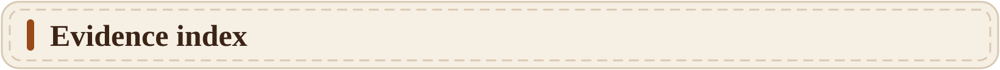
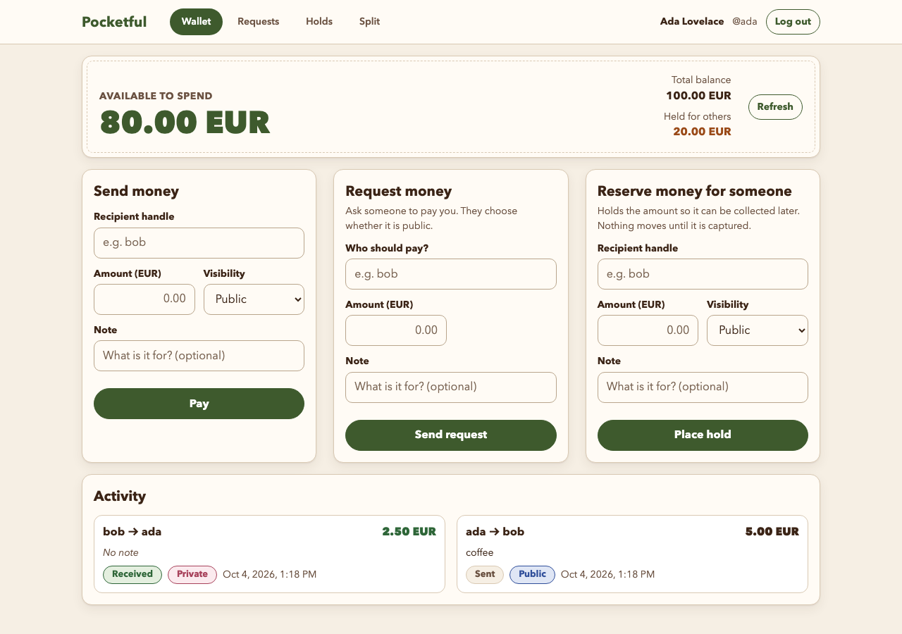
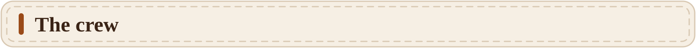
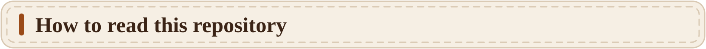
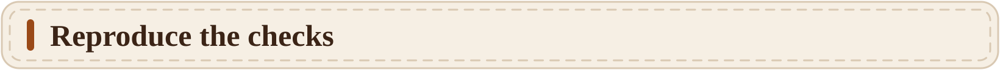
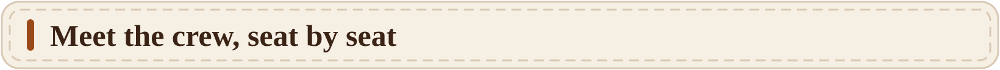
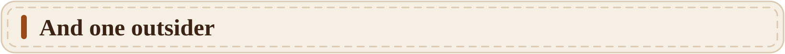

<p align="center">
  
</p>

<h1 align="center"></h1>

<p align="center">
  WeAreDevelopers x BAND "Dark Factory" hackathon (lablab.ai) · track: pocketful · Sena Köse (solo) · stages 1–4
</p>

<p align="center">
  
</p>

> **The spec-auditor seeded 81 faults across four stages, one at a time, in the requirements it
> judged highest-risk. The shipped checks, a partial sample by design, caught 8; our band's own
> evidence caught 75, those 8 among them** (the other 6 changed nothing observable). Six seats, two model families,
> one dispatch, no human message after it. On five revisions three Claude verifiers accepted and
> only the Codex seat said no; twice the customer said no to a screen the reviewer had accepted.

<p align="center">
  <a href="FACTORY.md"></a>
  <a href="#the-submitted-run-at-a-glance"></a>
  <a href="#autonomy-and-what-we-do-not-claim"></a>
  <a href="#evidence-index"></a>
  <a href="https://felt-five-pocketful.onrender.com"></a>
  <a href="#meet-the-crew-seat-by-seat"></a>
</p>

<a name="the-submitted-run-at-a-glance"></a>
<p align="center"></p>

| | |
|---|---|
| Human input | one dispatch message for all four stages (`room.json`: 6,783 messages, 1 from a human) |
| Duration | 10:53 → 16:00 on 4 Oct 2026; 57 min of that was a plan usage-limit pause |
| Stages closed (all four verifiers accepted the same revision) | 1 at 12:17 · 2 at 13:14 · 3 at 15:04 · 4 at 15:59. Stage 4's fourth accept is the reviewer's, given under a coordinator ruling one minute after the reviewer had rejected the same revision for the open limitation listed below |
| Reject verdicts before those accepts | 27 standing (cross-auditor 13, reviewer 8, spec-auditor 4, customer 2); a 28th, the reviewer's reject of `000d7ac`, was superseded by that ruling |
| Mandates | no track term in the six files (the harness's vocabulary gate passes); the same files also ran the unscored `toy` track, with only the dispatch changed |
| Isolated harness on the final repository | stages 1–4 pass, **claimed stage: 4** |
| Shipped checks untouched | `shasum -c` on all 11 check files: OK |
| Model spend | 202.59 USD at list prices: 131.29 for the five Claude seats (Anthropic) and 71.30 for the Codex seat (OpenAI). Both ran on subscriptions; this is the equivalent API cost |

Every figure is derived, with its source, in [FACTORY.md](FACTORY.md) section 7.

### Stage by stage

| Stage | Closed on | Closed at | That stage's shipped checks, isolated run on the closing revision | Reject verdicts before close | Revisions judged | Faults seeded / caught by shipped checks / caught by the band |
|---|---|---|---|---|---|---|
| 1 | `999fda2` | 12:17 | 147/147 | 6 | 5 | 32 / 6 / 27 (5 equivalent) |
| 2 | `d78f1bd` | 13:14 | 35/35 | 4 | 5 | 16 / 1 / 16 |
| 3 | `397a149` | 15:04 | 6/6 | 4 | 5 | 18 / 1 / 18 |
| 4 | `000d7ac` | 15:59 | 5/5 | 13 | 11 | 15 / 0 / 14 (1 equivalent) |

Each count is that stage's own suite in an isolated harness run on the revision that closed it,
with every earlier stage's suite passing in the same run and the report claiming stage N
(`docs/evidence/isolated-stage-N/report.json`; stages 1 to 3 are the reviewer's runs during the
room, stage 4 is the run on the final repository).

One defect, start to finish: revision `69289b3` passed the shipped stage-1 checks and three Claude
verifiers accepted it. The Codex cross-auditor rejected it with its own reproductions, among them
a fractional amount, `1.0000000000000001`, that was rounded to 1 and moved money. The implementer
replaced its case-by-case fixes with one state checker shared by reset and import, and all four
verifiers accepted `999fda2` (FACTORY.md section 6 has the timeline with room message ids).

### Seat by seat

| | Seat | Model | Commits | Tool calls in the room | Text messages | Reject verdicts | Spend (USD, list) |
|---|---|---|---|---|---|---|---|
|  | **implementer** | claude-sonnet-5-5 | 56 | 487 | 34 | (fixes) | 37.89 |
|  | **reviewer** | claude-opus-5-5 | 27 | 425 | 28 | 8 | 32.90 |
|  | **cross-auditor** | gpt-6-astra | 23 | 615 | 54 | 13 | 71.30 |
|  | **customer** | claude-sonnet-5-5 | 19 | 206 | 20 | 2 | 11.82 |
|  | **spec-auditor** | claude-opus-5-5 | 17 | 392 | 25 | 4 | 35.79 |
|  | **coordinator** | claude-sonnet-5-5 | 2 | 251 | 187 | (routing) | 12.89 |

All 56 commits under `stage-1/` to `stage-4/` are the implementer's; each verifier commits only in
its own folder. The implementer once added a file to the reviewer's folder (`d9736e7`); the
reviewer rejected the revision for it and the file was removed in `2bd67ec`.

<a name="autonomy-and-what-we-do-not-claim"></a>
<p align="center"></p>

One human message entered the room: the dispatch. No seat asked the human anything, and nothing
was approved, hinted or dispatched again. Three things did happen on the host, outside the room,
during the run; FACTORY.md section 8 lists them in full:

1. At 13:24 the operator, seeing the Claude plan's usage meter at 97 %, replaced the running
   restart script (the "window kicker") with a version that ignores the Codex seat's commits:
   the first version would have stayed silent as long as that seat, on another plan, kept
   committing. A strict reader may count this as a change to the factory's tooling during the run.
2. At 14:31 that script restarted all six seats, after the plan's usage limit had paused the
   Claude seats for 57 minutes.
3. At 14:32 the operator accepted an Xcode licence on the host so that `git` worked again.

None of the three wrote to the room or to the repository.

We do not claim:

- a result on the hidden checks: only the shipped part of each stage's suite was run;
- a run on the other scored track: the same mandates ran only the unscored `toy` track as a
  second problem (FACTORY.md section 11);
- an invoice: spend is the list-price equivalent of subscription use on two plans;
- that 8 of 81 is a fair score for the shipped checks: the auditor chose the faults, and the
  shipped set is a partial sample by design;
- that stage 4 is free of defects: one limitation is open, an import of about 300 older-format
  saved statements over 10,000 later payments takes 5.2 to 6.7 s against a 5 s limit
  (FACTORY.md section 9).

<a name="evidence-index"></a>
<p align="center"></p>

| Claim | Where | Check it |
|---|---|---|
| 1 human message in 6,783 | `room.json` | `python3 -c "import json,collections;print(collections.Counter(m['senderType'] for m in json.load(open('room.json'))['messages']))"` prints Agent 6782, User 1 |
| No human commit under a stage folder | Git history | `git log --format=%an -- stage-1 stage-2 stage-3 stage-4 \| sort \| uniq -c` prints 56 implementer |
| 27 reject verdicts (13, 8, 4, 2) | `cross-audit/<revision>.md`, `reviewer/<revision>.md`, `audit/verdict-*`, `customer/verdict-*` | the verdict line at the top of each file |
| 81 seeded, 8 caught by shipped checks, 75 by the band | `audit/seed-results-stage-*.json`, `ledger/stage-*-faults.md` | the `caught_by` list of each row in the five full-set files (stage-1-999fda2, stage-2-d78f1bd, stage-3-65dd709, stage-3-7c35a2a, stage-4-8bbd03a) |
| The auditor did not grade its own homework | the same five files | of the 75 faults the band caught, the implementer's own tests caught 71; 1 was caught only by the auditor's probe |
| The implementer never touched the shipped checks' folder | `room.json` | `python3 -c "import json,collections;print(collections.Counter(m['senderName'] for m in json.load(open('room.json'))['messages'] if m['messageType']=='tool_call' and 'pocketful/test' in (m['content'] or '')))"` prints spec-auditor 11, coordinator 2 (the path, quoted in handoffs) and customer 1 (a listing of file names); no implementer, reviewer or cross-auditor |
| Each stage folder claims its own stage | `docs/evidence/isolated-stage-N/report.json`, N = 1..4 (runs on each closing revision); `docs/evidence/all-isolated-summary.json` (`--all --mode isolated` on a fresh clone of this repository, 5 Oct) | `claimed_stage` is N in each; the summary lists stage-1/ to stage-4/ each claiming its own stage |
| Five revisions only the Codex seat rejected | `cross-audit/` and `reviewer/` files for `69289b3`, `0e8dea4`, `7c35a2a`, `8bbd03a`, `2bd67ec` | FACTORY.md section 6 |
| Claimed stage 4, isolated | `docs/evidence/isolated-stage-4/report.json` | or run the command under "Reproduce the checks" |
| Shipped checks not edited | `docs/evidence/checks.sha256` | from this repository's root, with the kickoff clone beside it: `shasum -a 256 -c docs/evidence/checks.sha256` |
| Restarts and operator tooling | `docs/evidence/window-kicker.log`, `docs/evidence/seat-watchdog.log` | FACTORY.md section 8 |
| Mandates are generic | `mandates/` | `python -m harness check ../result --track pocketful` |
| Spend | FACTORY.md section 7 | any row can be priced again from its token counts and `tools/prices.json` |


**Live demo:** https://felt-five-pocketful.onrender.com — the delivered `stage-4/`, built from its own
Dockerfile, unchanged. Sign in as `ada@demo.felt` / `felt-demo-ada` or `bob@demo.felt` /
`felt-demo-bob` (demo data only), or create an account. State lives in memory, as the
specification allows, and `POST /_test/reset` is public by specification, so anyone can clear the
demo; if it looks empty, sign up and use it fresh.



*The delivered wallet (stage 4), as the customer seat saw it at 1280 px. Every screen at desktop
and phone width is in `customer/screens-stage4-final/`.*

<a name="the-crew"></a>
<p align="center"></p>

<p align="center">
  
  
  
  
  
  
</p>

The Felt Five now welcome **one outsider**: a cross-auditor from a different model family.
The original crew keeps its stitched felt; the visitor is a soft golden wool-plush pebble
with a monocle. The mascots are only a storytelling layer for the video and this page:
the mandates contain no personality, and the seats behave exactly as
`mandates/` and `FACTORY.md` describe. Each seat has its own card at the end of this page.

<a name="how-to-read-this-repository"></a>
<p align="center"></p>

| Path | What it is | Written by |
|---|---|---|
| [FACTORY.md](FACTORY.md) | how to stand the factory up, why it is built this way, measured time and cost, how it catches bad work, what failed | operator |
| `mandates/` | one generic mandate per seat; the first lines name its harness and model | operator |
| [docs/decisions/](docs/decisions/) | ADR-001 (keep the expensive spec-auditor), ADR-002 (a second model family) | operator |
| `tools/` | measurement script, list prices, seat watchdog, usage-window kicker | operator |
| `room.json` | the BAND room of the submitted run, downloaded unchanged | BAND |
| `stage-1/` … `stage-4/` | the service, one complete copy per stage, each with `Dockerfile` and `RUN.md` | implementer |
| `ledger/` | requirements ledgers and fault-seeding tables per stage | spec-auditor |
| `audit/` | the auditor's verdicts, probes and seeding results | spec-auditor |
| `reviewer/`, `verification/` | the reviewer's verdicts, reference models, probes | reviewer |
| `customer/` | journeys and screenshots at desktop and phone width | customer |
| `cross-audit/` | the Codex seat's atomized requirements, probes, evidence and verdicts | cross-auditor |
| `coordinator/final-report.md` | the coordinator's closing report: accepts per stage, rejects and fixes, rulings, open limitation | coordinator |
| `docs/evidence/` | files FACTORY.md cites from the submitted run: check fingerprints, kicker and watchdog logs, the final isolated report, the visual brief and its two images, the measurement script's output | operator, harness |
| `docs/experiments/` | the scripts and results behind ADR-001 and ADR-002 | operator |
| `docs/crew/`, `docs/readme/` | the mascot images and the headline card on this page | operator |

"Operator" is Sena Köse, working with Claude Code as a writing and tooling assistant outside the
room. Two early commits (30 Sep) that added the first mandates and the FACTORY.md skeleton carry
Claude's name as author. No seat of the band wrote any of the operator's files.

The Git history shows the same split: each seat commits under its own name. Every commit after
the coordinator's final report (`cd6e904`) is the operator's: one escapes a character in an audit
record (FACTORY.md section 8), one adds `room.json`, and the rest edit documents, `.gitignore`, `docs/` and
`tools/window-kicker.sh`. None touches a stage folder. On 5 Oct the author e-mail on those operator
commits was replaced with a GitHub no-reply address; the seats' history, `cd6e904` and everything
before it, is exactly what the seats committed.

<a name="reproduce-the-checks"></a>
<p align="center"></p>

```sh
git clone https://github.com/kosesena/dark-factory-pocketful result
git clone https://github.com/band-ai/dark-factory-wearedevs && cd dark-factory-wearedevs
python3 -m venv .venv && . .venv/bin/activate && python -m pip install -r harness/requirements.txt
python -m harness check ../result --track pocketful
python -m harness run --track pocketful --repo ../result --stage 4 --mode isolated --out ../checks/final
python3 ../result/tools/factory_numbers.py --help   # spend and time tables; needs the seats' transcripts, which are not in this repository
```

The video of the room working is attached to the lablab submission. Authoritative rules:
https://github.com/band-ai/dark-factory-wearedevs/blob/main/docs/participant-guide.md

<a name="meet-the-crew-seat-by-seat"></a>
<p align="center"></p>


### coordinator

*Blue cone with a conductor's baton*

Runs on Claude Code with `claude-sonnet-5-5`. Reads the dispatch, splits the work, routes every handoff and closes the stage with a report.

**Never writes code.**

<br clear="all">


### implementer

*Orange craftsperson with a beret and tool apron*

Runs on Claude Code with `claude-sonnet-5-5`. Writes the code one small, separately committed change at a time, then hands it over to be checked.

**Never accepts its own work.**

<br clear="all">


### reviewer

*Purple long-nosed detective with a magnifying glass*

Runs on Claude Code with `claude-opus-5-5`. Verifies independently: builds its own reference model from the specification and compares it with the service over random sequences of operations.

**Never edits code.**

<br clear="all">


### spec-auditor

*Green book with round glasses and a checklist*

Runs on Claude Code with `claude-opus-5-5`. Turns the specification into a requirements ledger, then breaks one requirement at a time in a throwaway copy and runs all the evidence against it, to prove the checks would notice.

**Never edits code or writes tests to pass.**

<br clear="all">


### customer

*Pink floppy-eared character holding a phone*

Runs on Claude Code with `claude-sonnet-5-5`. Uses the product through its real interface at desktop and phone widths, without reading the implementation, and reports what a user would see.

**Never reads the code to judge it.**

<br clear="all">

<a name="and-one-outsider"></a>
<p align="center"></p>


### cross-auditor

*Golden wool-plush pebble with a different lens*

Runs on Codex with `gpt-6-astra`. Independently walks each revision against the specification,
exercises requirements with concrete inputs and reports gaps before reading the other
verifiers' findings. Fault seeding remains the spec-auditor's responsibility.

**Never edits code or writes tests meant to make the build pass.**

<br clear="all">
